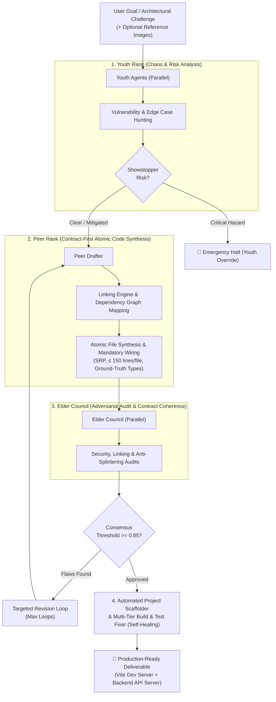

# Aztec Decision Circle (LLM) 🏛️⚡

[]()
[](https://www.python.org/downloads/)
[](https://opensource.org/licenses/MIT)
[]()
[]()
[]()
[]()
[]()

```
  ██████╗ ███████╗████████╗███████╗ ██████╗ 
  ██╔══██╗╚════██║╚══██╔══╝██╔════╝██╔════╝ 
  ███████║    ██╔╝   ██║   █████╗  ██║      
  ██╔══██║   ██╔╝    ██║   ██╔══╝  ██║      
  ██║  ██║   ██║     ██║   ███████╗╚██████╗ 
  ╚═╝  ╚═╝   ╚═╝     ╚═╝   ╚══════╝ ╚═════╝ 
   Multi-Generational Adversarial LLM Debate Framework
```

**Aztec Decision Circle** is a production-grade, multi-generational meta-tool designed to build software tools, hybrid fullstack web applications, and complex architectures through rigorous adversarial LLM debate, automated quality gates, incremental line-range edits, multimodal vision analysis, native SSE streaming, holistic dependency linking, and self-healing build orchestration.

---

## ⚡ Quick Start: One-Line Installation

Install Aztec instantly on **Linux**, **macOS**, or **WSL** into an isolated user environment:

```bash
curl -fsSL https://raw.githubusercontent.com/JUANITOTELO/aztec-cirlce-llm/main/install.sh | bash
```

Once installed, launch the interactive terminal interface:

```bash
aztec
```

Or self-update anytime with:

```bash
aztec update
```

---

## 🏛️ Multi-Generational Architecture

Aztec replaces naive single-prompt LLM generation with a structured generational debate cycle:



### The Three Generational Ranks

1. **🧠 Youth Rank (Exploration & Anomaly Detection)**:
   - Evaluates the goal using distinct adversarial personas (*Chaos Brainstormer*, *Devil's Advocate*).
   - Identifies non-obvious security risks, architectural anti-patterns, and UX traps before code is written.
   - Holds unilateral **Emergency Override** power to halt unsafe or catastrophic directives.

2. **⚙️ Peer Rank (Atomic Synthesis & Holistic Linking)**:
   - Synthesizes robust, production-grade source code following **Atomic Design Principles**:
     - Strict Single Responsibility Principle (SRP).
     - Hard file-length limits ($\le 150$ lines per file).
     - **Contract-First Synthesis**: Domain types in `src/types/` are locked as ground truth before generating implementation files, preventing signature splintering across hooks and engines.
     - **Holistic Linking Engine**: Automatically maps project import graphs and entry points (`App.tsx`, routers, store slices, seed data) and mandates integration patches so zero components are left orphaned.

3. **👁️ Elder Council (Security & Governance Audit)**:
   - Independent dual-auditor council (*Security & Risk Auditor*, *Senior Structural Architect*).
   - Evaluates code drafts with weighted scoring ($\ge 0.85$ required for release) across Linking Completeness, Contract Coherence, Security, UI Completeness, and Database Integrity.
   - Rejection feedback feeds directly into targeted peer revision loops.

---

## 🚀 Key Capabilities

### 1. 📐 Mathematically Correct Code Generation (Categorical & Topological Engine)
Aztec models the entire code generation and mutation pipeline as a **formal category**:
- **Objects & Morphisms**: Source files are modeled as typed objects (`CodegenFile`); import dependencies are directed morphisms (`ImportEdge`).
- **Topological Sorter (Kahn's Algorithm & BFS)**: Computes a total dependency ordering over the import graph to ensure files are synthesized in strict dependency order (ground-truth types $\rightarrow$ domain engines/stores $\rightarrow$ hooks $\rightarrow$ UI components $\rightarrow$ coordinators $\rightarrow$ tests).
- **Cycle Freedom (3-Color DFS)**: Detects circular import dependencies before writing to disk and rejects invalid non-DAG proposals.
- **Categorical Coherence Checker**: Evaluates functorial preservation of ground-truth contracts (`src/types/`). Guarantees that destructured parameters and component props (`{ field }: MyType`) strictly conform to declared interface signatures.
- **Grammar-Aware AST Validator (`tree-sitter`)**: Validates TypeScript, TSX, and Python syntax trees pre-flight before applying any patches to disk.
- **Natural Transformation Safety (Semantic Diff)**: Diffs pre/post dependency graphs to guarantee that patches never silently delete active exports or leave newly synthesized modules orphaned.

---

### 2. 🔗 Holistic Linking Engine & Dependency Graph Mapping
- **Import Graph Discovery**: Cross-ecosystem import parsing for TypeScript/JavaScript (`import`/`require`), Python (`import`/`from`), and PHP (`use`/`require_once`).
- **Coordinator Auto-Detection**: Discovers top-level coordinators (`App.tsx`, routers, database contexts, navigation bars, mock data seeds).
- **Mandatory Integration Enforcement**: Injects mandatory patch anchors into consensus prompts and audits drafts to guarantee every newly created component or module is actively wired into parent views.
- **`.aztec.json` Overrides**: Configure custom entry points and integration rules per repository.

---

### 3. 🔧 Comprehensive Build & Test Self-Healing (`aztec fix`)
- **Multi-Tier Error Recovery**: Diagnoses and automatically repairs syntax errors, TypeScript compile failures (`tsc --noEmit`), Vite transform issues, and broken unit test assertions (`vitest`, `jest`, `pytest`, `phpunit`).
- **Verified Success Gates**: Never claims false-positive fixes; actively re-executes both build and test suites on each iteration loop until full correctness is verified.
- **Fingerprint De-duplication**: Tracks recurring error signatures to prevent oscillation cycles during automated repair.

---

### 4. 🌐 Hybrid Fullstack Scaffolding & Multi-Service Dev Server
- **Topology Detection**: Automatically recognizes `php_react`, `python_react`, `lean4_react`, `vite_react`, `node`, `php`, `python`, and `lean4`.
- **Automatic Reverse Proxying**: Injects `/api` $\rightarrow$ `http://127.0.0.1:8000` into `vite.config.ts` for instant fullstack communication.
- **Dual-Service Lifecycle (`aztec start`)**: Spawns both the Backend API server (`php -S 127.0.0.1:8000` / Python) and Frontend Vite HMR in parallel with unified logging and clean process-group teardown.
- **Automatic Port Conflict Fallback**: Intelligently scans and binds to the next free port if `5173` or `8000` are in use.
- **Port Manager (`aztec clean --ports`)**: Instantly frees lingering background dev servers across port ranges (`5173–5185`, `8000–8015`).

---

### 5. 🧪 Unified Multi-Tier Test Runner (`aztec test`)
Run your entire stack's test suites with a single command:
- **PHP Backend**: `php backend/test_backend.php` / `phpunit`.
- **Frontend UI**: `vitest run` / `npm test` (with auto-provisioned `src/test/setup.ts`).
- **Python Backend**: `pytest` / `unittest`.
- **Formal Proofs**: `lake test` / `lake build`.

---

### 6. 🌊 Native Async SSE Streaming & Connection Resilience
- **Real-Time Token Streaming**: Streams tokens continuously via Server-Sent Events (SSE) for zero lost tokens and immediate feedback.
- **Inactivity Watchdog**: Robust 90-second chunk watchdog prevents hanging network connections.
- **Adaptive Thinking**: Full support for Claude 3.7 / 3.5 Sonnet adaptive thinking budgets.

---

### 7. 📷 Multimodal Vision & Image Support
Pass design mockups, wireframes, 3D diagrams, or screenshots directly into the debate circle or edit engine:

```bash
# Generate full project from a design wireframe
aztec run "Build an interactive 3D robot mannequin studio" --image ./wireframe.png --auto-build

# Apply an incremental edit using an image directly from your system clipboard
aztec edit "Match toolbar styling to screenshot" --paste --path ./my_app
```

- **Instant Clipboard Pasting (`Ctrl+V`)**: Press `Ctrl+V` or `Alt+V` in the interactive TUI to attach any screenshot or image currently on your system clipboard (Wayland, X11, macOS, Windows).
- **Drag & Drop Path Cleaning**: Paste or drag file paths with `file://` or quotes directly into `/image` or the prompt.

---

### 8. ⚡ Incremental Edit Engine (Precision 2-Round Patching)
Update and improve existing projects with token-effective line-range modifications:

```bash
# Surgical 2-round line patch + automatic typecheck & compiler repair
aztec edit "Add keyboard shortcuts: R for reset, W for wireframe toggle" --path ./examples/cellular_automata_app
```

- **Round 1 (File Selector)**: Analyzes project symbol index (~300 tokens) to identify only the files needing changes.
- **Round 2 (Patch Generator)**: Generates minimal, structured JSON line replacements (`replace`, `insert_before`, `insert_after`, `create`, `delete`) with atomic rollback protection and resilient `json-repair` parsing.

---

### 9. 🗺️ Living Project Blueprint & Roadmap (`AZTEC_PLAN.md`)
Maintains an evolving project blueprint tracking architecture decisions, module dependencies, and completed/upcoming milestones. Synchronize anytime with:

```bash
aztec plan --sync
```

---

## 💻 CLI Commands Reference

| Command | Description | Example |
| :--- | :--- | :--- |
| `aztec` | Launch interactive TUI session (supports `Ctrl+V` image paste) | `aztec` |
| `aztec run <goal>` | Execute full debate loop for a task (`--image`, `--paste` / `-P`) | `aztec run "Build a Kanban app" -B -S --paste` |
| `aztec edit <instruction>`| Apply targeted line-range patch (`--image`, `--paste` / `-P`) | `aztec edit "Add dark mode toggle" -p ./app -P` |
| `aztec config` | Manage API keys, model assignments, presets, and ping tests | `aztec config --preset anthropic_cost_optimized` |
| `aztec plan` | View or synchronize living roadmap (`AZTEC_PLAN.md`) | `aztec plan --sync` |
| `aztec build <path>` | Scaffold, install deps, and build | `aztec build ./examples/colombian_accounting_system` |
| `aztec fix <path>` | Run self-healing multi-tier compiler error repair | `aztec fix ./examples/colombian_accounting_system` |
| `aztec test <path>` | Execute multi-tier project test suite (PHP, Node, Python, Lean) | `aztec test ./examples/colombian_accounting_system` |
| `aztec start <path>` | Launch background development server & API daemons | `aztec start ./examples/colombian_accounting_system -p 5173` |
| `aztec clean` | Free occupied server ports and clean temporary artifacts | `aztec clean --ports` |
| `aztec update` | Self-update Aztec to latest version | `aztec update` |
| `aztec list-runs` | View checkpointed SQLite run history | `aztec list-runs` |
| `aztec serve` | Start real-time Web Inspector API | `aztec serve --port 8000` |

---

## 🕹️ Interactive TUI Slash Commands

Inside the interactive `aztec` TUI prompt:

| Slash Command | Description |
| :--- | :--- |
| `/config` / `/setup` | **Open interactive configuration center** (API keys, models, presets, test) |
| `/keys` | View status and securely set LLM provider API keys (`0600` permissions) |
| `/models` | View model catalog and assign models to agent ranks (`/models catalog`) |
| `/preset <name>` | Apply one-click architecture preset (`anthropic_cost_optimized`, `speed_budget`, `max_reasoning`, etc.) |
| `/test-models` | Probe all active rank models with a live 1-token latency ping |
| `Ctrl+V` / `Alt+V` | **Paste image directly from system clipboard** (updates prompt badge) |
| `/paste` / `/paste-image` | Grab and attach image from system clipboard |
| `/image <path_or_url>` | Attach reference image(s) or drag & dropped file path |
| `/images` | List all attached images in the session |
| `/clear-images` | Clear attached images |
| `/edit <instruction>` | Apply an atomic incremental edit to active project |
| `/plan` | View or synchronize the Living Blueprint & Roadmap |
| `/rebuild` | Force a full generational debate to regenerate project |
| `/fix` | Run automated build error repair on active project |
| `/test` | Run multi-tier project test suite |
| `/start` | Launch live development server & backend API |
| `/stop` | Stop background development server |
| `/clean` / `/ports` | Free occupied dev server ports (`5173–5185`, `8000–8015`) |
| `/logs` | View background development server output logs |
| `/update` | Check for and apply latest Aztec updates |
| `/status` | View session spend, token usage, and active models |
| `/runs` | List checkpointed task runs |
| `/resume <task_id>` | Resume a past task run from checkpoint |

---

## 🛠️ Local Development & Testing

### Installation from Source
```bash
git clone https://github.com/JUANITOTELO/aztec-cirlce-llm.git
cd aztec-cirlce-llm
python -m venv .venv
source .venv/bin/activate
pip install -e ".[dev]"
```

### Running Automated Test Suite
```bash
pytest tests/ -v --asyncio-mode=auto --cov=aztec_circle
```

---

## 📄 License
MIT © Juanitotelo & Aztec Contributors
