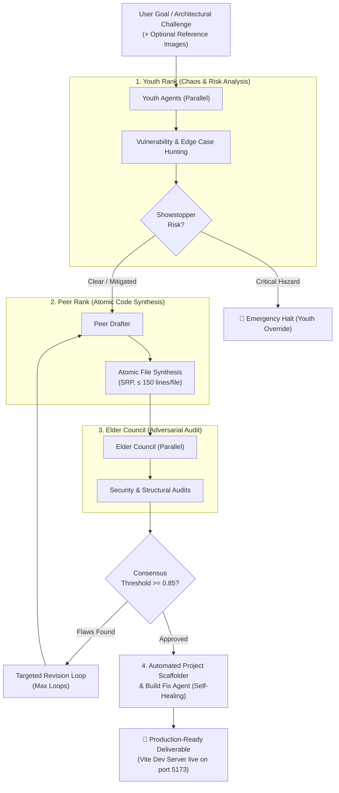

# Aztec Decision Circle (LLM) 🏛️⚡

[](https://www.python.org/downloads/)
[](https://opensource.org/licenses/MIT)
[]()
[]()
[]()

```
  ██████╗ ███████╗████████╗███████╗ ██████╗ 
  ██╔══██╗╚════██║╚══██╔══╝██╔════╝██╔════╝ 
  ███████║    ██╔╝   ██║   █████╗  ██║      
  ██╔══██║   ██╔╝    ██║   ██╔══╝  ██║      
  ██║  ██║   ██║     ██║   ███████╗╚██████╗ 
  ╚═╝  ╚═╝   ╚═╝     ╚═╝   ╚══════╝ ╚═════╝ 
   Multi-Generational Adversarial LLM Debate Framework
```

**Aztec Decision Circle** is a production-grade, multi-generational meta-tool designed to build software tools, web applications, and complex architectures through rigorous, adversarial LLM debate, automated quality gates, incremental line-range edits, and multimodal vision analysis.

---

## ⚡ Quick Start: One-Line Installation

Install Aztec instantly on **Linux**, **macOS**, or **WSL** into an isolated user environment:

```bash
curl -fsSL https://raw.githubusercontent.com/JUANITOTELO/aztec-cirlce-llm/main/install.sh | bash
```

Once installed, launch the interactive terminal interface:

```bash
aztec
```

Or self-update anytime with:

```bash
aztec update
```

---

## 🏛️ Multi-Generational Architecture

Aztec replaces naive single-prompt LLM generation with a structured generational debate cycle:



### The Three Generational Ranks

1. **🧠 Youth Rank (Exploration & Anomaly Detection)**:
   - Evaluates the goal using distinct adversarial personas (*Chaos Brainstormer*, *Devil's Advocate*).
   - Identifies non-obvious security risks, architectural anti-patterns, and UX traps before code is written.
   - Holds unilateral **Emergency Override** power to halt unsafe or catastrophic directives.

2. **⚙️ Peer Rank (Atomic Synthesis & Engineering)**:
   - Synthesizes robust, production-grade source code following **Atomic Design Principles**:
     - Strict Single Responsibility Principle (SRP).
     - Hard file-length limits ($\le 150$ lines per file).
     - Decoupled folder contracts (`src/atoms/`, `src/components/`, `src/hooks/`, `src/engine/`, `src/store/`, `src/utils/`, `src/types/`).

3. **👁️ Elder Council (Security & Governance Audit)**:
   - Independent dual-auditor council (*Security & Risk Auditor*, *Senior Structural Architect*).
   - Evaluates code drafts with a weighted 0.0 – 1.0 scoring threshold ($\ge 0.85$ required for release).
   - Rejection feedback feeds directly into targeted peer revision loops.

---

## 🚀 Key Capabilities

### 1. 📷 Multimodal Vision & Image Support
Pass design mockups, wireframes, 3D diagrams, or screenshots directly into the debate circle or edit engine:

```bash
# Generate full project from a design wireframe
aztec run "Build an interactive 3D robot mannequin studio" --image ./wireframe.png --auto-build

# Apply an incremental edit using an image directly from your system clipboard
aztec edit "Match toolbar styling to screenshot" --paste --path ./my_app
```

- **Instant Clipboard Pasting (`Ctrl+V`)**: Press `Ctrl+V` or `Alt+V` in the interactive TUI to attach any screenshot or image currently on your system clipboard (Wayland, X11, macOS, Windows).
- **Drag & Drop Path Cleaning**: Paste or drag file paths with `file://` or quotes directly into `/image` or the prompt.

---

### 2. ⚡ Incremental Edit Engine (Precision 2-Round Patching)
Update and improve existing projects with token-effective line-range modifications:

```bash
# Surgical 2-round line patch + automatic typecheck & compiler repair
aztec edit "Add keyboard shortcuts: R for reset, W for wireframe toggle" --path ./dummy13_app
```

- **Round 1 (File Selector)**: Analyzes project symbol index (~300 tokens) to identify only the files needing changes.
- **Round 2 (Patch Generator)**: Generates minimal, structured JSON line replacements (`replace`, `insert_before`, `insert_after`, `create`, `delete`) with atomic rollback protection and resilient `json-repair` parsing.

### 3. 🔧 Self-Healing Quality Gate & Build Runner
Automated end-to-end build runner:
- Automatic ecosystem detection (Vite / React / Tailwind / Node / Python).
- Atomic, file-by-file TypeScript compiler repair (`BuildFixAgent`).
- Integrated dev server lifecycle manager (`npm run dev` on port 5173).

---

## 💻 CLI Commands Reference

| Command | Description | Example |
| :--- | :--- | :--- |
| `aztec` | Launch interactive TUI session (supports `Ctrl+V` image paste) | `aztec` |
| `aztec run <goal>` | Execute full debate loop for a task (`--image`, `--paste` / `-P`) | `aztec run "Build a Kanban app" -B -S --paste` |
| `aztec edit <instruction>`| Apply targeted line-range patch (`--image`, `--paste` / `-P`) | `aztec edit "Add dark mode toggle" -p ./app -P` |
| `aztec build <path>` | Scaffold, install deps, and build | `aztec build ./aztec_output` |
| `aztec fix <path>` | Run self-healing compiler error repair | `aztec fix ./aztec_output` |
| `aztec test <path>` | Execute project unit test suite | `aztec test ./aztec_output` |
| `aztec start <path>` | Launch background development server | `aztec start ./aztec_output -p 5173` |
| `aztec update` | Self-update Aztec to latest version | `aztec update` |
| `aztec list-runs` | View checkpointed SQLite run history | `aztec list-runs` |
| `aztec serve` | Start real-time Web Inspector API | `aztec serve --port 8000` |

---

## 🕹️ Interactive TUI Slash Commands

Inside the interactive `aztec` TUI prompt:

| Slash Command | Description |
| :--- | :--- |
| `Ctrl+V` / `Alt+V` | **Paste image directly from system clipboard** (updates prompt badge) |
| `/paste` / `/paste-image` | Grab and attach image from system clipboard |
| `/image <path_or_url>` | Attach reference image(s) or drag & dropped file path |
| `/images` | List all attached images in the session |
| `/clear-images` | Clear attached images |
| `/edit <instruction>` | Apply an atomic incremental edit to active project |
| `/rebuild` | Force a full generational debate to regenerate project |
| `/fix` | Run automated build error repair on active project |
| `/test` | Run project test suite |
| `/start` | Launch live development server on port 5173 |
| `/stop` | Stop background development server |
| `/update` | Check for and apply latest Aztec updates |
| `/status` | View session spend, token usage, and active models |
| `/runs` | List checkpointed task runs |
| `/resume <task_id>` | Resume a past task run from checkpoint |

---

## 🛠️ Local Development & Testing

### Installation from Source
```bash
git clone https://github.com/JUANITOTELO/aztec-cirlce-llm.git
cd aztec-cirlce-llm
python -m venv .venv
source .venv/bin/activate
pip install -e ".[dev]"
```

### Running Automated Test Suite
```bash
pytest tests/ -v --asyncio-mode=auto --cov=aztec_circle
```

---

## 📄 License
MIT © Juanito Telo & Aztec Contributors
