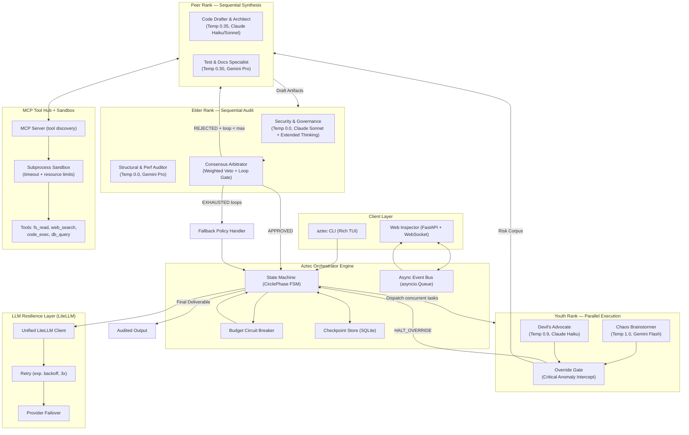

# Aztec Decision Circle: Revised Production Architecture & Implementation Plan (v2)

## Goal Description

Build a **production-ready, fault-tolerant, multi-generational LLM debate framework** — the *Aztec Decision Circle* — designed to prevent echo chambers, hallucinated consensus, and unbounded token spend by routing every task through three adversarially structured agent ranks before producing any audited output.

This v2 plan supersedes the initial draft and resolves all 7 identified architectural gaps:
1. Async concurrency model for parallel Youth sub-agents
2. Prompt template system with versioning
3. MCP client full specification (tool discovery, scoping, timeout, sandboxing)
4. LLM retry & resilience layer (exponential backoff, failover, timeout)
5. State persistence & checkpoint strategy
6. Structured escalation fallback policy
7. Tool sandboxing & injection prevention

**Target Stack**: Python 3.11+ · LiteLLM (unified adapter) · Anthropic + Google Gemini + OpenAI + Ollama · FastAPI + WebSocket · SQLite checkpoint store · MCP SDK

---

## User Review Required

> [!IMPORTANT]
> **LLM Provider Keys Required**: The build will use `LiteLLM` as the unified provider adapter. You will need at least one of: `ANTHROPIC_API_KEY`, `GOOGLE_AI_API_KEY` / `VERTEX_AI_PROJECT`, `OPENAI_API_KEY`, or a running Ollama instance. The `.env` setup is part of the implementation.

> [!WARNING]
> **MCP Tool Server Scope**: The plan provisions an MCP tool hub with access to filesystem, web search, and terminal execution. The sandboxing layer uses `subprocess` with resource limits (`ulimit`, `timeout`). Full Docker container sandboxing is noted as a future phase enhancement for production deployments.

> [!CAUTION]
> **Cost Awareness**: Running the full 3-rank debate loop with Elder extended thinking enabled can consume $0.05–$0.20 per complex task at standard rates. The default budget circuit breaker is set to `$1.00` per session. Adjust `BUDGET_LIMIT_USD` in `.env` before running high-volume tests.

---

## Open Questions

> [!IMPORTANT]
> None remaining — all design decisions resolved via user confirmation. Proceeding to full implementation plan.

---

## Revised Architecture Overview



---

## Proposed Changes

---

### Component 1: Project Scaffold

#### [NEW] `pyproject.toml`
```toml
[project]
name = "aztec-circle-llm"
version = "0.1.0"
requires-python = ">=3.11"
dependencies = [
  "litellm>=1.40.0",
  "anthropic>=0.30.0",
  "google-genai>=0.7.0",
  "mcp>=1.0.0",
  "fastapi>=0.115.0",
  "uvicorn[standard]>=0.30.0",
  "websockets>=12.0",
  "pydantic>=2.7.0",
  "pydantic-settings>=2.3.0",
  "rich>=13.7.0",
  "typer>=0.12.0",
  "aiosqlite>=0.20.0",
  "tenacity>=8.3.0",      # Retry / resilience
  "structlog>=24.2.0",    # Structured logging
  "opentelemetry-sdk>=1.25.0",
  "python-dotenv>=1.0.0",
]

[project.optional-dependencies]
dev = ["pytest>=8.0", "pytest-asyncio>=0.23", "pytest-mock>=3.14", "httpx>=0.27"]

[project.scripts]
aztec = "aztec_circle.cli:app"
```

#### [NEW] `.env.example`
```env
# LLM Provider Keys (at least one required)
ANTHROPIC_API_KEY=sk-ant-...
GOOGLE_AI_API_KEY=AIza...
OPENAI_API_KEY=sk-...
OLLAMA_BASE_URL=http://localhost:11434

# Model assignments per rank
YOUTH_MODEL=gemini/gemini-2.5-flash
PEER_MODEL=claude-3-5-haiku-20241022
ELDER_MODEL=claude-3-5-sonnet-20241022

# Debate governance
MAX_DEBATE_LOOPS=2
BUDGET_LIMIT_USD=1.00
ELDER_THINKING_BUDGET=1024

# MCP Server
MCP_SERVER_URI=http://localhost:8765
MCP_TOOL_TIMEOUT_SECONDS=15

# Checkpoint store
CHECKPOINT_DB_PATH=./aztec_runs.db
```

---

### Component 2: Domain Layer (Revised Models + Events)

#### [MODIFY] `aztec_circle/domain/models.py`
Key additions over v1: `FallbackPolicy`, `CheckpointRecord`, `ToolCallResult`, `SessionMetadata`.

```python
from enum import Enum
from typing import List, Dict, Any, Optional
from pydantic import BaseModel, Field
from datetime import datetime
import uuid

# --- Enumerations ---

class AgentRank(str, Enum):
    YOUTH = "YOUTH"
    PEER = "PEER"
    ELDER = "ELDER"

class CirclePhase(str, Enum):
    IDLE = "IDLE"
    YOUTH_BRAINSTORM = "YOUTH_BRAINSTORM"       # Parallel: Chaos + Advocate
    YOUTH_OVERRIDE_CHECK = "YOUTH_OVERRIDE_CHECK"
    PEER_DRAFTING = "PEER_DRAFTING"
    ELDER_AUDIT = "ELDER_AUDIT"
    ARBITRATION = "ARBITRATION"
    RESOLVED = "RESOLVED"
    EMERGENCY_HALTED = "EMERGENCY_HALTED"
    ESCALATED = "ESCALATED"                      # NEW: Loop exhausted, policy invoked

class VerdictStatus(str, Enum):
    APPROVED = "APPROVED"
    REJECTED = "REJECTED"
    HALT_OVERRIDE = "HALT_OVERRIDE"

class FallbackPolicy(str, Enum):
    """Applied when MAX_DEBATE_LOOPS exhausted without consensus."""
    BEST_EFFORT_RELEASE = "BEST_EFFORT_RELEASE"  # Release best-scored draft with warnings
    HUMAN_IN_THE_LOOP   = "HUMAN_IN_THE_LOOP"    # Pause and emit escalation event for operator
    ABORT               = "ABORT"                # Hard stop, persist state, raise exception

class SeverityLevel(str, Enum):
    LOW = "LOW"
    MEDIUM = "MEDIUM"
    HIGH = "HIGH"
    CRITICAL = "CRITICAL"

# --- Youth Rank ---

class YouthRiskItem(BaseModel):
    id: str = Field(default_factory=lambda: str(uuid.uuid4())[:8])
    category: str
    description: str
    severity: SeverityLevel
    suggested_mitigation: str
    is_showstopper: bool = False

class YouthBrainstormOutput(BaseModel):
    agent_id: str
    radical_ideas: List[str]
    identified_risks: List[YouthRiskItem]
    adversarial_scenarios: List[str]
    override_triggered: bool = False
    override_rationale: Optional[str] = None
    tokens_used: int = 0

# --- Peer Rank ---

class ToolCallResult(BaseModel):
    tool_name: str
    arguments: Dict[str, Any]
    result: str
    duration_ms: float
    sandboxed: bool = True

class PeerDraftOutput(BaseModel):
    agent_id: str
    loop_index: int
    architecture_overview: str
    implementation_code: Dict[str, str] = Field(default_factory=dict)
    mitigations_applied: List[str]
    assumptions_made: List[str]
    tool_calls: List[ToolCallResult] = Field(default_factory=list)
    tokens_used: int = 0

# --- Elder Rank ---

class ElderAuditItem(BaseModel):
    criterion: str
    weight: float = Field(..., ge=0.0, le=1.0, description="Weight in consensus sum")
    score: float = Field(..., ge=0.0, le=10.0)
    critique: str
    passed: bool

class ElderVerdict(BaseModel):
    agent_id: str
    status: VerdictStatus
    weighted_score: float = Field(..., ge=0.0, le=10.0)
    audit_items: List[ElderAuditItem]
    critical_flaws: List[str]
    reworking_instructions: Optional[str] = None
    thinking_summary: Optional[str] = None
    tokens_used: int = 0

# --- Session State ---

class CircleRunState(BaseModel):
    task_id: str = Field(default_factory=lambda: str(uuid.uuid4()))
    goal: str
    fallback_policy: FallbackPolicy = FallbackPolicy.HUMAN_IN_THE_LOOP
    current_phase: CirclePhase = CirclePhase.IDLE
    loop_count: int = 0
    max_loops: int = 2
    youth_outputs: List[YouthBrainstormOutput] = Field(default_factory=list)
    peer_history: List[PeerDraftOutput] = Field(default_factory=list)
    elder_verdicts: List[ElderVerdict] = Field(default_factory=list)
    total_input_tokens: int = 0
    total_output_tokens: int = 0
    total_cost_usd: float = 0.0
    budget_limit_usd: float = 1.00
    final_output: Optional[Dict[str, Any]] = None
    escalation_message: Optional[str] = None
    created_at: datetime = Field(default_factory=datetime.utcnow)
    updated_at: datetime = Field(default_factory=datetime.utcnow)
```

#### [NEW] `aztec_circle/domain/exceptions.py`
```python
class AztecBaseException(Exception): ...
class LoopLimitExceeded(AztecBaseException): ...
class BudgetExceeded(AztecBaseException): ...
class YouthOverrideHalt(AztecBaseException):
    def __init__(self, rationale: str):
        self.rationale = rationale
        super().__init__(f"Youth Override triggered: {rationale}")
class LLMProviderFailure(AztecBaseException): ...
class MCPToolTimeout(AztecBaseException): ...
class MCPInjectionRisk(AztecBaseException): ...
```

---

### Component 3: Prompt Template System (NEW — was missing in v1)

#### [NEW] `aztec_circle/prompts/` module
```
aztec_circle/prompts/
├── __init__.py
├── registry.py          # Loads and versions prompt templates
├── youth_chaos.txt      # Youth Chaos Brainstormer system prompt
├── youth_advocate.txt   # Youth Devil's Advocate system prompt
├── peer_drafter.txt     # Peer Worker system prompt (loop-0 variant)
├── peer_drafter_loop.txt  # Peer revision prompt (loop N > 0, injects Elder instructions)
├── elder_security.txt   # Elder Security Auditor system prompt
└── elder_structural.txt # Elder Structural Auditor system prompt
```

#### [NEW] `aztec_circle/prompts/registry.py`
```python
from pathlib import Path
from string import Template
from functools import lru_cache

PROMPTS_DIR = Path(__file__).parent

@lru_cache(maxsize=None)
def _load_template(name: str) -> Template:
    """Load prompt file once per process lifecycle for cache-friendly reuse."""
    return Template((PROMPTS_DIR / f"{name}.txt").read_text(encoding="utf-8"))

def render(name: str, **kwargs) -> str:
    """Render a named prompt template with variable substitution."""
    return _load_template(name).substitute(**kwargs)
```

**Design rationale**: By loading system prompts from static files with `@lru_cache`, the prompt text stays immutable across all loop iterations — this is the prerequisite for Anthropic/Google Prompt Caching to activate (identical leading prompt bytes are required). All dynamic context (Youth risk log, Elder rework instructions) is injected only in the **user turn**, not the system prompt.

---

### Component 4: LLM Resilience Layer (NEW — was missing in v1)

#### [NEW] `aztec_circle/adapters/llm_provider.py`
```python
import asyncio
from typing import Any, AsyncIterator
from tenacity import (
    retry, stop_after_attempt, wait_exponential,
    retry_if_exception_type, before_sleep_log
)
import litellm
import structlog

log = structlog.get_logger()

RETRYABLE = (litellm.RateLimitError, litellm.APIConnectionError, litellm.Timeout)

class LLMProvider:
    def __init__(self, primary: str, fallback: str | None = None, timeout: float = 60.0):
        self.primary = primary
        self.fallback = fallback
        self.timeout = timeout

    @retry(
        stop=stop_after_attempt(3),
        wait=wait_exponential(multiplier=1, min=2, max=30),
        retry=retry_if_exception_type(RETRYABLE),
        before_sleep=before_sleep_log(log, "warning"),
        reraise=True,
    )
    async def complete(
        self,
        messages: list[dict],
        model: str | None = None,
        temperature: float = 0.7,
        thinking_budget: int | None = None,
        **kwargs,
    ) -> dict:
        target = model or self.primary
        extra = {}
        if thinking_budget:
            extra["thinking"] = {"type": "enabled", "budget_tokens": thinking_budget}
        try:
            resp = await asyncio.wait_for(
                litellm.acompletion(
                    model=target,
                    messages=messages,
                    temperature=temperature,
                    **extra,
                    **kwargs,
                ),
                timeout=self.timeout,
            )
            return resp
        except Exception as exc:
            if self.fallback and target != self.fallback:
                log.warning("llm.primary_failed", model=target, error=str(exc))
                return await self.complete(
                    messages, model=self.fallback, temperature=temperature, **kwargs
                )
            raise
```

---

### Component 5: MCP Client — Full Specification (NEW — under-specified in v1)

#### [NEW] `aztec_circle/adapters/mcp_client.py`
```python
import asyncio
import json
import re
import subprocess
from typing import Any
from aztec_circle.domain.exceptions import MCPToolTimeout, MCPInjectionRisk
from aztec_circle.config import settings

# Injection risk patterns — primitive but effective first-line guard
_INJECTION_PATTERNS = [
    r";\s*rm\s+-",        # Shell deletion
    r"&&\s*curl",         # Chain + exfil
    r"\|\s*bash",         # Pipe to shell
    r"__import__",        # Python eval escape
    r"\.\./\.\./",        # Path traversal
]

def _check_injection(payload: str) -> None:
    for pattern in _INJECTION_PATTERNS:
        if re.search(pattern, payload, re.IGNORECASE):
            raise MCPInjectionRisk(f"Injection risk pattern matched: {pattern!r}")

class MCPClient:
    """
    Stateless MCP client: discovers tools from server manifest on init,
    then executes tool calls inside a sandboxed subprocess with strict resource limits.
    """

    def __init__(self, uri: str = settings.MCP_SERVER_URI):
        self.uri = uri
        self._tools: dict[str, dict] = {}

    async def discover_tools(self) -> list[dict]:
        """Fetch tool manifest from MCP server and cache locally."""
        import httpx
        async with httpx.AsyncClient(timeout=10.0) as client:
            resp = await client.get(f"{self.uri}/tools/list")
            resp.raise_for_status()
            manifest = resp.json()
        self._tools = {t["name"]: t for t in manifest["tools"]}
        return manifest["tools"]

    def get_tool_schemas(self) -> list[dict]:
        """Return OpenAI-compatible function schemas for use in LLM tool_choice."""
        return [
            {
                "type": "function",
                "function": {
                    "name": t["name"],
                    "description": t["description"],
                    "parameters": t.get("input_schema", {}),
                },
            }
            for t in self._tools.values()
        ]

    async def call_tool(self, name: str, arguments: dict[str, Any]) -> str:
        """
        Execute an MCP tool call inside a sandboxed subprocess.
        - Checks for injection patterns before execution.
        - Enforces wall-clock timeout via asyncio.
        - Resource limits applied via ulimit in subprocess shell.
        """
        _check_injection(json.dumps(arguments))

        payload = json.dumps({"tool": name, "arguments": arguments})
        cmd = [
            "bash", "-c",
            # ulimit: 256MB memory, no new files > 10MB, 15s cpu
            f"ulimit -v 262144 -f 10240 -t 15; "
            f"curl -sf -X POST {self.uri}/tools/call "
            f"-H 'Content-Type: application/json' -d '{payload}'"
        ]
        try:
            result = await asyncio.wait_for(
                asyncio.create_subprocess_exec(
                    *cmd,
                    stdout=asyncio.subprocess.PIPE,
                    stderr=asyncio.subprocess.PIPE,
                ),
                timeout=settings.MCP_TOOL_TIMEOUT_SECONDS,
            )
            stdout, _ = await result.communicate()
            return stdout.decode("utf-8", errors="replace")
        except asyncio.TimeoutError:
            raise MCPToolTimeout(f"MCP tool '{name}' exceeded timeout of {settings.MCP_TOOL_TIMEOUT_SECONDS}s")
```

**Tool Permission Scoping**: Each agent rank receives a filtered subset of tools:
- **Youth Agents**: `web_search`, `fs_read` (read-only)
- **Peer Agents**: `web_search`, `fs_read`, `fs_write`, `code_exec`
- **Elder Agents**: `fs_read` only (no write or exec — auditors observe, not mutate)

---

### Component 6: Async Concurrency Model (NEW — missing in v1)

#### [NEW] `aztec_circle/engine/state_machine.py` (key async concurrency excerpt)

```python
import asyncio
from aztec_circle.domain.models import CircleRunState, CirclePhase, FallbackPolicy
from aztec_circle.agents.youth import YouthAgent
from aztec_circle.agents.peer import PeerAgent
from aztec_circle.agents.elder import ElderAgent
from aztec_circle.engine.consensus import ConsensusEngine
from aztec_circle.engine.checkpoint import CheckpointStore
from aztec_circle.engine.budget_manager import BudgetManager
from aztec_circle.domain.exceptions import YouthOverrideHalt, BudgetExceeded, LoopLimitExceeded

class AztecOrchestrator:
    def __init__(self, state: CircleRunState, event_queue: asyncio.Queue):
        self.state = state
        self.events = event_queue
        self.checkpoint = CheckpointStore()
        self.budget = BudgetManager(limit_usd=state.budget_limit_usd)
        self.consensus = ConsensusEngine()

    async def run(self) -> dict:
        await self._transition(CirclePhase.YOUTH_BRAINSTORM)

        # ── PHASE 1: Youth Brainstorm ──────────────────────────────────────────
        # Run Chaos Brainstormer + Devil's Advocate CONCURRENTLY
        chaos_agent   = YouthAgent(persona="chaos_brainstormer")
        advocate_agent = YouthAgent(persona="devils_advocate")

        youth_results = await asyncio.gather(
            chaos_agent.run(self.state.goal),
            advocate_agent.run(self.state.goal),
            return_exceptions=True,
        )

        for result in youth_results:
            if isinstance(result, Exception):
                await self._emit("youth.error", {"error": str(result)})
                continue
            self.state.youth_outputs.append(result)
            self.budget.record(result.tokens_used)

        # ── PHASE 2: Youth Override Gate ──────────────────────────────────────
        await self._transition(CirclePhase.YOUTH_OVERRIDE_CHECK)
        all_risks = [r for o in self.state.youth_outputs for r in o.identified_risks]
        showstoppers = [r for r in all_risks if r.is_showstopper]

        if showstoppers:
            self.state.current_phase = CirclePhase.EMERGENCY_HALTED
            await self.checkpoint.save(self.state)
            raise YouthOverrideHalt(f"{len(showstoppers)} critical anomaly(s) detected: "
                                    + "; ".join(r.description for r in showstoppers))

        # ── PHASE 3: Peer Drafting Loop ────────────────────────────────────────
        peer_agent = PeerAgent()
        elder_instructions: str | None = None

        while self.state.loop_count <= self.state.max_loops:
            await self._transition(CirclePhase.PEER_DRAFTING)
            self.budget.check()  # Raises BudgetExceeded if over limit

            draft = await peer_agent.run(
                goal=self.state.goal,
                youth_risks=self.state.youth_outputs,
                elder_instructions=elder_instructions,
                loop_index=self.state.loop_count,
            )
            self.state.peer_history.append(draft)
            self.budget.record(draft.tokens_used)
            await self.checkpoint.save(self.state)

            # ── PHASE 4: Elder Audit ───────────────────────────────────────────
            await self._transition(CirclePhase.ELDER_AUDIT)
            elder_security  = ElderAgent(persona="security_governance")
            elder_structural = ElderAgent(persona="structural_perf")

            # Elders also run concurrently
            verdicts = await asyncio.gather(
                elder_security.audit(draft, self.state.goal),
                elder_structural.audit(draft, self.state.goal),
            )
            for v in verdicts:
                self.state.elder_verdicts.append(v)
                self.budget.record(v.tokens_used)

            # ── PHASE 5: Arbitration ───────────────────────────────────────────
            await self._transition(CirclePhase.ARBITRATION)
            verdict = self.consensus.arbitrate(verdicts)

            if verdict.status.value == "APPROVED":
                self.state.final_output = {"draft": draft.model_dump(), "verdict": verdict.model_dump()}
                self.state.current_phase = CirclePhase.RESOLVED
                await self.checkpoint.save(self.state)
                return self.state.final_output

            # Not approved: check loop budget
            if self.state.loop_count >= self.state.max_loops:
                return await self._invoke_fallback(draft, verdict)

            elder_instructions = verdict.reworking_instructions
            self.state.loop_count += 1

        return await self._invoke_fallback(None, None)

    async def _invoke_fallback(self, best_draft, last_verdict) -> dict:
        """Structured fallback policy handler."""
        await self._transition(CirclePhase.ESCALATED)
        policy = self.state.fallback_policy

        if policy == FallbackPolicy.BEST_EFFORT_RELEASE:
            msg = "Max loops exhausted. Releasing best-scored draft with Elder anomaly flags."
            self.state.final_output = {
                "draft": best_draft.model_dump() if best_draft else None,
                "verdict": last_verdict.model_dump() if last_verdict else None,
                "warning": msg,
            }
        elif policy == FallbackPolicy.HUMAN_IN_THE_LOOP:
            self.state.escalation_message = (
                f"Task '{self.state.task_id}' requires human review: "
                f"debate loop exhausted after {self.state.loop_count} iterations. "
                f"Unresolved flaws: {last_verdict.critical_flaws if last_verdict else 'unknown'}"
            )
            self.state.final_output = {"escalation": self.state.escalation_message}
        elif policy == FallbackPolicy.ABORT:
            raise LoopLimitExceeded(f"Max loops {self.state.max_loops} exhausted without consensus.")

        await self.checkpoint.save(self.state)
        return self.state.final_output or {}

    async def _transition(self, phase: CirclePhase):
        self.state.current_phase = phase
        await self._emit("phase.change", {"phase": phase.value, "task_id": self.state.task_id})

    async def _emit(self, event: str, payload: dict):
        await self.events.put({"event": event, **payload})
```

---

### Component 7: Consensus & Arbitration Engine

#### [NEW] `aztec_circle/engine/consensus.py`
```python
from aztec_circle.domain.models import ElderVerdict, VerdictStatus, ElderAuditItem

APPROVAL_THRESHOLD = 8.0
CRITICAL_FLAW_PENALTY = 2.5
ELDER_WEIGHTS = {
    "security_governance": 0.60,  # Security elder: higher weight
    "structural_perf": 0.40,
}

class ConsensusEngine:
    def arbitrate(self, verdicts: list[ElderVerdict]) -> ElderVerdict:
        """
        Weighted average of Elder scores minus critical flaw penalties.
        Produces a synthetic consolidated verdict.
        """
        weighted_score = 0.0
        all_flaws: list[str] = []
        all_instructions: list[str] = []

        for verdict in verdicts:
            weight = ELDER_WEIGHTS.get(verdict.agent_id, 1.0 / len(verdicts))
            weighted_score += weight * verdict.weighted_score
            all_flaws.extend(verdict.critical_flaws)

            if verdict.reworking_instructions:
                all_instructions.append(f"[{verdict.agent_id}] {verdict.reworking_instructions}")

        # Apply penalty for each unique critical flaw
        unique_flaws = list(dict.fromkeys(all_flaws))
        final_score = max(0.0, weighted_score - len(unique_flaws) * CRITICAL_FLAW_PENALTY)

        approved = final_score >= APPROVAL_THRESHOLD and len(unique_flaws) == 0

        return ElderVerdict(
            agent_id="consensus_arbitrator",
            status=VerdictStatus.APPROVED if approved else VerdictStatus.REJECTED,
            weighted_score=round(final_score, 2),
            audit_items=[],
            critical_flaws=unique_flaws,
            reworking_instructions="\n\n".join(all_instructions) if all_instructions else None,
        )
```

---

### Component 8: State Persistence & Checkpointing (NEW — missing in v1)

#### [NEW] `aztec_circle/engine/checkpoint.py`
```python
import json
import aiosqlite
from aztec_circle.domain.models import CircleRunState
from aztec_circle.config import settings

class CheckpointStore:
    """
    Persists CircleRunState to SQLite after every phase transition.
    Enables resuming crashed or human-escalated runs.
    """

    async def _conn(self) -> aiosqlite.Connection:
        db = await aiosqlite.connect(settings.CHECKPOINT_DB_PATH)
        await db.execute("""
            CREATE TABLE IF NOT EXISTS runs (
                task_id TEXT PRIMARY KEY,
                state_json TEXT NOT NULL,
                updated_at TEXT NOT NULL
            )
        """)
        await db.commit()
        return db

    async def save(self, state: CircleRunState) -> None:
        async with await self._conn() as db:
            await db.execute(
                "INSERT OR REPLACE INTO runs VALUES (?, ?, ?)",
                (state.task_id, state.model_dump_json(), state.updated_at.isoformat()),
            )
            await db.commit()

    async def load(self, task_id: str) -> CircleRunState | None:
        async with await self._conn() as db:
            async with db.execute(
                "SELECT state_json FROM runs WHERE task_id = ?", (task_id,)
            ) as cursor:
                row = await cursor.fetchone()
                if row:
                    return CircleRunState.model_validate_json(row[0])
        return None

    async def list_runs(self) -> list[dict]:
        async with await self._conn() as db:
            async with db.execute(
                "SELECT task_id, updated_at FROM runs ORDER BY updated_at DESC"
            ) as cursor:
                return [{"task_id": r[0], "updated_at": r[1]} async for r in cursor]
```

---

### Component 9: CLI + Web Inspector

#### [NEW] `aztec_circle/cli.py`
```python
import asyncio
import typer
from rich.console import Console
from rich.live import Live
from rich.table import Table
from aztec_circle.domain.models import CircleRunState, FallbackPolicy
from aztec_circle.engine.state_machine import AztecOrchestrator

app = typer.Typer(help="Aztec Decision Circle — Multi-Generational LLM Debate Framework")
console = Console()

@app.command()
def run(
    task: str = typer.Argument(..., help="The task or goal for the Circle to solve"),
    budget: float = typer.Option(1.00, help="Max spend in USD for this run"),
    max_loops: int = typer.Option(2, help="Max Elder rejection loops before escalation"),
    fallback: FallbackPolicy = typer.Option(FallbackPolicy.HUMAN_IN_THE_LOOP),
):
    """Run a full Aztec Decision Circle debate loop for a given task."""
    asyncio.run(_run_async(task, budget, max_loops, fallback))

async def _run_async(task: str, budget: float, max_loops: int, fallback: FallbackPolicy):
    state = CircleRunState(goal=task, max_loops=max_loops, budget_limit_usd=budget, fallback_policy=fallback)
    event_queue: asyncio.Queue = asyncio.Queue()

    with Live(console=console, refresh_per_second=4) as live:
        async def _listen():
            while True:
                event = await event_queue.get()
                live.update(_render_table(state, event))

        listener = asyncio.create_task(_listen())
        orchestrator = AztecOrchestrator(state, event_queue)
        result = await orchestrator.run()
        listener.cancel()

    console.print_json(data=result)

def _render_table(state: CircleRunState, last_event: dict) -> Table:
    t = Table(title=f"Aztec Circle — {state.task_id[:8]}", expand=True)
    t.add_column("Phase"), t.add_column("Loops"), t.add_column("Cost"), t.add_column("Last Event")
    t.add_row(state.current_phase.value, str(state.loop_count), f"${state.total_cost_usd:.4f}", last_event.get("event", ""))
    return t

@app.command()
def serve(port: int = typer.Option(8000, help="Port for the Web Inspector")):
    """Start the real-time Web Inspector (FastAPI + WebSocket)."""
    import uvicorn
    from aztec_circle.server.app import create_app
    uvicorn.run(create_app(), host="0.0.0.0", port=port)

@app.command()
def resume(task_id: str = typer.Argument(...)):
    """Resume a previously halted or escalated run by task_id."""
    asyncio.run(_resume_async(task_id))

async def _resume_async(task_id: str):
    from aztec_circle.engine.checkpoint import CheckpointStore
    store = CheckpointStore()
    state = await store.load(task_id)
    if not state:
        console.print(f"[red]No run found with task_id: {task_id}")
        raise typer.Exit(1)
    console.print(f"[green]Resuming run {task_id} from phase: {state.current_phase.value}")
    event_queue: asyncio.Queue = asyncio.Queue()
    orchestrator = AztecOrchestrator(state, event_queue)
    result = await orchestrator.run()
    console.print_json(data=result)
```

---

### Component 10: Test Suite

#### [NEW] `tests/test_state_machine.py`
- Tests: `IDLE → YOUTH_BRAINSTORM → OVERRIDE_CHECK → PEER_DRAFTING → ELDER_AUDIT → ARBITRATION → RESOLVED`
- Tests loop capping: After 2 rejections, verify `ESCALATED` phase is reached.
- Tests `BudgetExceeded` exception at `PEER_DRAFTING` when mock spend exceeds limit.

#### [NEW] `tests/test_consensus.py`
- Tests: Approval at score ≥ 8.0 with 0 critical flaws.
- Tests: Rejection when 1+ critical flaw forces score below threshold.
- Tests: Weight distribution correctness (`security_governance` at 0.60, `structural_perf` at 0.40).

#### [NEW] `tests/test_youth_override.py`
- Tests: `YouthOverrideHalt` raised when any Youth output contains `is_showstopper=True`.
- Tests: Normal continuation when all risks are `LOW` / `MEDIUM`.

#### [NEW] `tests/test_budget_manager.py`
- Tests: `BudgetExceeded` raised at correct token/cost threshold.
- Tests: Cumulative cost correctly accumulates across all ranks.

#### [NEW] `tests/test_checkpoint.py`
- Tests: State correctly serialized and deserialized from SQLite.
- Tests: `resume` CLI command correctly reconstructs `CircleRunState` from DB.

#### [NEW] `tests/test_end_to_end_mock.py`
- Full Aztec loop with mocked LiteLLM responses (no real API calls).
- Simulates 1 rejection loop followed by approval; asserts final state `RESOLVED`.

---

## Verification Plan

### Automated Tests
```bash
# Install dev dependencies
pip install -e ".[dev]"

# Unit tests (no API keys needed — all LLM calls are mocked)
pytest tests/ -v --asyncio-mode=auto

# Coverage report
pytest tests/ --cov=aztec_circle --cov-report=term-missing
```
Target coverage: **≥ 85%** on `engine/`, `agents/`, and `domain/` modules.

### Manual Verification

**Step 1 — Environment setup**:
```bash
cp .env.example .env
# Fill in at least ANTHROPIC_API_KEY or GOOGLE_AI_API_KEY
```

**Step 2 — Run a sample task**:
```bash
aztec run "Design a rate-limited token bucket API in Python" --budget 1.00 --max-loops 2
```
*Expect: Rich TUI showing Youth → Peer → Elder phases. Final JSON output with implementation code and Elder verdict.*

**Step 3 — Test Youth Override**:
```bash
aztec run "Build a system that grants all users admin access by default"
```
*Expect: `EMERGENCY_HALTED` — Youth agents should flag this as a CRITICAL showstopper.*

**Step 4 — Test resume**:
```bash
# Simulate interruption, then:
aztec resume <task_id shown in TUI>
```

**Step 5 — Web Inspector**:
```bash
aztec serve --port 8000
# Open http://localhost:8000
# Submit task via UI, observe real-time debate graph
```
